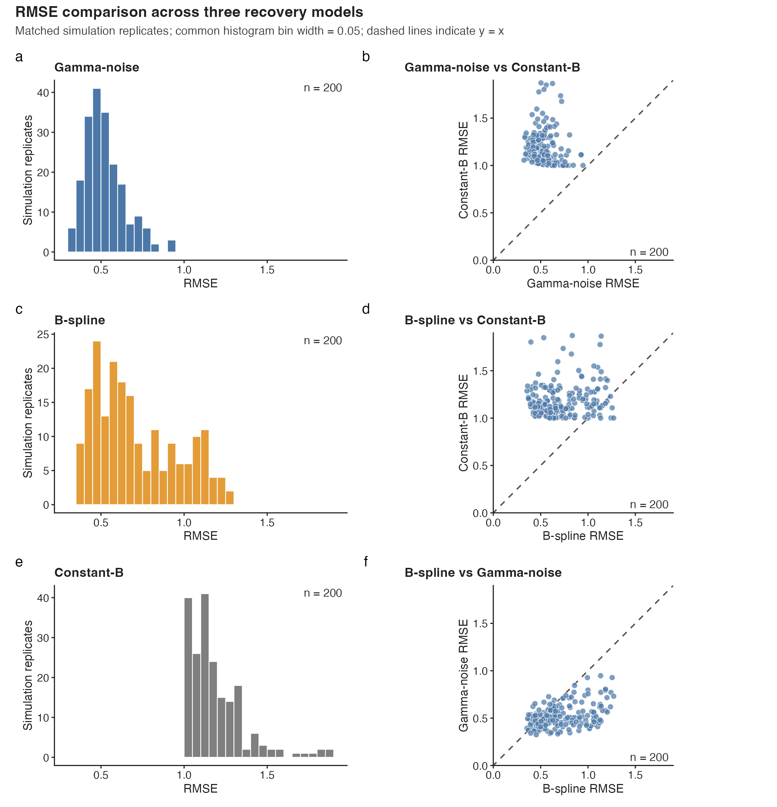

# Simulation-Based Transmission-Rate Recovery

[](https://github.com/ZeuS2U35-YX/Simulation-Based-Transmission-Rate-Recovery/actions/workflows/validate.yml)
[](https://doi.org/10.5281/zenodo.22127917)
[](LICENSE)

This project studies how well three transmission-rate representations recover
a prescribed step change from partially observed stochastic SIR epidemics. All
three models are evaluated on the same 200 accepted simulated outbreaks, with
task IDs, random seeds, and data checksums used to enforce pairing.

The repository contains the R workflows, retained post-processed evidence,
publication-quality figures, provenance checks, and a lightweight numerical
regression test. It also states explicitly which parts of the historical HPC
analysis can and cannot be reproduced from a fresh clone.

> **Development status.** The archived public release is
> [v1.0.0](https://github.com/ZeuS2U35-YX/Simulation-Based-Transmission-Rate-Recovery/releases/tag/v1.0.0).
> Post-v1.0.0 work corrects the Gamma-noise aggregate path from an
> ancestry-sampled trajectory to the observation-time particle filtering mean.
> It also normalizes the reporting truth at week 5 to $B(5)=4$ without changing
> the simulated observations, fitted parameters, or likelihood evaluations.
> Because that changes an analysis estimand and its numerical summaries, it is
> recorded as an analysis correction rather than a documentation-only change.
> The original release remains immutable; no v1.1.0 release or DOI is claimed.

## Results at a glance

The final comparison evaluates latent-path recovery over the complete 10-week,
70-observation-time window. Lower RMSE is better.

| Fitted model | Representation of $B(t)$ | Mean RMSE |
| --- | --- | ---: |
| Gamma-noise | Positive latent stochastic process; particle filtering mean | 0.5218 |
| B-spline | Deterministic non-periodic cubic spline for $\log B(t)$ with six basis coefficients | 0.7128 |
| Constant-$B$ | One fitted scalar repeated across the observation window | 1.1858 |

In paired replicate-level comparisons, Gamma-noise has lower RMSE than
B-spline in 162/200 tasks, B-spline has lower RMSE than constant-$B$ in
188/200 tasks, and Gamma-noise has lower RMSE than constant-$B$ in 200/200
tasks.



These results concern recovery of a known latent transmission path under one
configured simulation design. They are not predictive-performance results,
significance tests, or evidence of a universal ranking on real surveillance
data.

Primary retained evidence:

- [overall three-model summary](experiments/experiment_5_bspline_B_recovery/results/comparison_three_models/three_model_overall_summary.csv);
- [paired RMSE summary](experiments/experiment_5_bspline_B_recovery/results/comparison_three_models/pairwise_RMSE_summary.csv);
- [paired-input manifest](experiments/experiment_5_bspline_B_recovery/results/paired_input_manifest.csv);
- [figure source data and visual QA](experiments/experiment_5_bspline_B_recovery/figures/comparison_three_models/).

## Five-minute verification

With Bash and R available, a fresh clone can check the tracked evidence without
installing contributed R packages and without running simulation, MIF2,
particle filtering, or Slurm:

```bash
git clone https://github.com/ZeuS2U35-YX/Simulation-Based-Transmission-Rate-Recovery.git
cd Simulation-Based-Transmission-Rate-Recovery
bash scripts/check_repository.sh
```

The check parses every project R file, validates every shell script, verifies
the 200-task manifest and path-provenance contracts, recomputes the full-window
three-model summaries, and checks the week-8 sensitivity analysis against the
tracked outputs.

### Observation-window sensitivity

Truncating the common path-recovery window at week 8 narrows the difference
between the two time-varying approaches. This recalculation uses retained
paths and does not refit either model.

| Model | Mean RMSE through week 8 |
| --- | ---: |
| Gamma-noise | 0.5501 |
| B-spline | 0.5808 |

Gamma-noise has lower truncated-window RMSE in 114/200 paired tasks; B-spline
has lower RMSE in the other 86. This
sensitivity result shows that the strength of the comparison depends on the
evaluation window; it does not replace the prespecified full-window analysis.
The most stable conclusion is the limitation of a constant transmission rate
under the prescribed step change; the relative comparison of the two
time-varying formulations is conditional on the evaluation window.
It can be regenerated separately with:

```bash
mkdir -p /tmp/transmission-week8
Rscript --vanilla scripts/compute_week8_sensitivity.R \
  /tmp/transmission-week8 8
```

See the tracked [week-8 summary](experiments/experiment_5_bspline_B_recovery/results/comparison_three_models/week8_sensitivity_summary.csv)
and [task-level values](experiments/experiment_5_bspline_B_recovery/results/comparison_three_models/week8_sensitivity_task_metrics.csv).

## Study design

One stochastic SIR data-generating process produces the shared simulation
replicates. Each accepted replicate contains 70 daily observation times over
10 weeks, reported counts follow a negative-binomial measurement model, and
acceptance requires $\max(H)>20$. Reported recovery performance is therefore
conditional on informative accepted outbreaks.

The same 200 accepted case series feed three fitted partially observed Markov
process (POMP) formulations:

```text
one stochastic SIR data-generating process
  -> 200 accepted simulated outbreaks
  -> Gamma-noise fits
  -> deterministic six-basis B-spline fits
  -> constant-B fits
  -> 200 paired comparison rows
```

The simulator implements $B(t)=4$ for process times $t<5$ and $B(t)=2$ for
$t\geq5$. Final observation-grid reporting uses the endpoint-aligned convention
$B(5)=4$ and recomputes recovery metrics accordingly. This reporting
normalization does not change simulated observations, fitted coefficients, or
saved fitted objects. Historical raw metrics and normalized final tables must
not be mixed.

For the Gamma-noise model, aggregate recovery uses an observation-time
particle filtering mean. Ancestry-preserving sampled paths are retained only
as clearly labelled selected-task illustrations. For the B-spline model, the
six coefficients are components of one fitted curve, not six separate models.
The independent analysis unit is the accepted simulation replicate—not a
particle, starting value, likelihood evaluation, or observation time.

## Experiment map

| Experiment | Purpose | Role in final result |
| --- | --- | --- |
| [1](experiments/experiment_1_gamma_B_recovery/) | Gamma-noise workflow development and starting-value diagnostics | Supporting |
| [2](experiments/experiment_2_large_scale_gamma_B_recovery_HPC/) | High-particle, single-data-set Gamma-noise diagnostic | Supporting |
| [3](experiments/experiment_3_gamma_B_recovery_accuracy/) | Earlier repeated Gamma-noise recovery study | Supporting; superseded for final claims |
| [4](experiments/experiment_4_nmif600_model_comparison/) | Shared accepted data and Gamma-noise/constant-$B$ fits | Computational foundation |
| [5](experiments/experiment_5_bspline_B_recovery/) | B-spline extension and paired three-model comparison | Final analysis |

## Reproduce the final figures

The Experiment 5 lockfile is intentionally limited to figure generation. From
that experiment directory:

```bash
cd experiments/experiment_5_bspline_B_recovery
Rscript -e 'renv::restore(prompt = FALSE)'
Rscript -e 'renv::status()'
Rscript code/06_plot_three_model_comparison.R
```

The workflow regenerates PDF, SVG, PNG, and 600-dpi TIFF exports plus source
CSV files. See the detailed
[figure-reproduction guide](experiments/experiment_5_bspline_B_recovery/REPRODUCE_FIGURES.md)
and [software record](SOFTWARE.md).

## Reproducibility scope

| Goal | Fresh clone | Additional requirements |
| --- | :---: | --- |
| Validate tracked manifests, path semantics, and numerical summaries | Yes | Bash and R |
| Regenerate the final comparison figures | Yes | Restore the Experiment 5 `renv.lock` |
| Recompute aggregate comparisons from tracked combined paths | Yes | Base R |
| Recombine all retained task-level fits | No | Untracked `shared_data/` and `results_raw/` trees |
| Run a new 200-task fit | No | Slurm, compiler toolchain, `pomp`, and substantial compute |
| Recreate the historical HPC run bit for bit | Not claimed | Complete historical package environment was not preserved |

The current v1.0.0 source archive does not contain every accepted input and raw
task output. A future full-replication package is planned, but it should not be
cited or treated as available until it is actually published. The
[package entry guide](README_FIRST.md) documents the intended boundary.

Full HPC workflows have deliberate submission guards. Inspect their plans
before setting the explicit confirmation variables:

```bash
cd experiments/experiment_4_nmif600_model_comparison
bash hpc/submit_pilot.sh --dry-run
bash hpc/submit_all.sh --dry-run

cd ../experiment_5_bspline_B_recovery
bash hpc/submit_all.sh --dry-run
```

Follow the experiment-specific READMEs before any full run. Experiment 5
fitting and post-processing use `Rscript --vanilla` so its plotting-only renv
profile cannot silently replace the separately provisioned `pomp` environment.

## Repository guide

```text
Simulation-Based-Transmission-Rate-Recovery/
├── scripts/                 Fast validation and release utilities
├── shared_code/             Shared model and analysis helpers
├── experiments/             Five documented experiment workflows
├── README_FIRST.md          Full-bundle entry guide
├── SOFTWARE.md              Dependency and environment boundaries
├── CITATION.cff             Machine-readable citation metadata
└── CHANGELOG.md             Corrections and unreleased changes
```

## Citation and release history

For work that uses the archived release, cite the version-specific record:

- Yixin Ma, *Simulation-Based Transmission-Rate Recovery*, v1.0.0;
- DOI: [10.5281/zenodo.22127917](https://doi.org/10.5281/zenodo.22127917);
- [GitHub release v1.0.0](https://github.com/ZeuS2U35-YX/Simulation-Based-Transmission-Rate-Recovery/releases/tag/v1.0.0).

Do not attribute unreleased branch results or corrections to v1.0.0. See
[CHANGELOG.md](CHANGELOG.md) for the distinction. Machine-readable metadata are
provided in [CITATION.cff](CITATION.cff).

## Acknowledgment and license

This project was conducted at Queen's University under the supervision of
Professor Felicia Magpantay.

Code is released under the [MIT License](LICENSE). Copyright © 2026 Yixin Ma.
